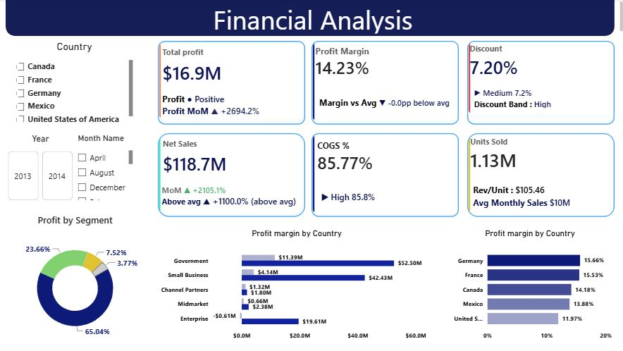
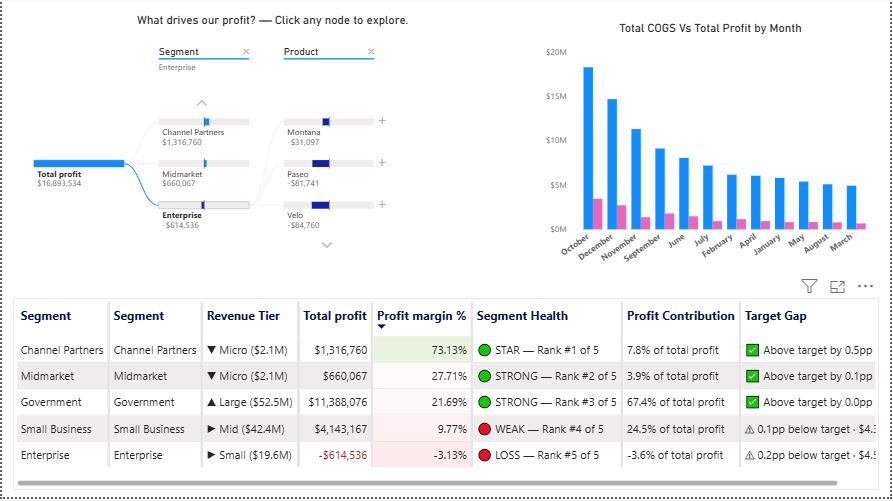

# Financial Performance Analysis Portfolio

I am a data analyst focused on turning raw business data into clear, decision-ready insights using Python, Power BI, and analytical storytelling. This project highlights my ability to clean financial data, derive meaningful KPIs, and present actionable business findings through interactive dashboards.

This project combines Python-based data cleaning and exploratory analysis with Power BI dashboard storytelling to uncover business insights across product lines, customer segments, countries, and pricing performance.

It is designed as a portfolio-ready business intelligence project that demonstrates how raw financial data can be transformed into actionable insights for decision-making.

---

## 📌 Project Overview

The analysis focuses on understanding the relationship between sales, profit, costs, discounts, and product performance. By cleaning and transforming the data in Python and then visualizing key trends in Power BI, this project highlights where value is being generated and where profitability is being weakened.

### Core objectives
- Analyze financial performance by segment, product, month, and country
- Identify profit drivers and loss-making segments
- Evaluate the effect of discounts and pricing on margin
- Present insights in an interactive dashboard for stakeholder review

---

## 📊 Project at a Glance

| Area | Details |
| --- | --- |
| Domain | Financial analytics and business intelligence |
| Data Source | Kaggle financial dataset |
| Analysis Language | Python |
| Visualization Tool | Power BI |
| Key Metrics | Profit, Sales, COGS, Discounts, Units Sold, Margins |
| Scope | Segment, country, product, month, and year performance |
| Output | Cleaned dataset + interactive dashboard |

---

## 🔄 Workflow

1. Data collection from the source financial dataset
2. Data cleaning and transformation in Python
3. KPI derivation and validation of financial columns
4. Exploratory data analysis for trends and relationships
5. Dashboard creation in Power BI for business storytelling
6. Insight generation and recommendations for stakeholders

---

## 🐍 Python Data Processing

The Python workflow includes:
- Data import and validation
- Removal of formatting inconsistencies such as currency symbols and commas
- Handling missing or invalid values
- Converting monetary columns to numeric values
- Calculating profit and discount-related metrics
- Exploratory visual analysis using Pandas, NumPy, Matplotlib, and Seaborn

This preprocessing prepares the data for structured business analysis and accurate dashboard reporting.

---

## 📈 Key Business Insights

The analysis reveals several important findings:
- The Government segment delivered the strongest profit contribution
- The Enterprise segment showed negative profit and requires strategic review
- Germany had the highest margin among the analyzed countries
- Discounts significantly influenced profitability and margin performance
- Net sales reached approximately $118.7M, with discount pressure affecting overall return

These results help identify both growth opportunities and areas where operating performance needs improvement.

---

## 💡 Recommendations

- Reassess the Enterprise strategy and cost structure to reduce losses
- Review discount policies to improve profit margin without reducing volume excessively
- Prioritize investment and sales focus on Government and Small Business segments
- Investigate product and country combinations with weaker margin efficiency
- Use the dashboard for ongoing monitoring of profitability trends over time

---

## 📉 Dashboard Preview

The project includes a Power BI dashboard and supporting visuals that summarize the financial story across the dataset.





---

## 🛠 Tech Stack

- Python
  - Pandas
  - NumPy
  - Matplotlib
  - Seaborn
- Power BI
- CSV dataset processing

---

## 📁 Repository Structure

```text
Financial_analysis/
├── dashboard/
│   └── Financial_dashboard.pbix
├── data/
│   └── Cleaned_Financuaks.csv
├── images/
│   ├── dashboard_1.JPG
│   └── dashboard_2.jpg
├── script/
│   └── financial_analysis.ipynb
├── .gitignore
├── README.md
└── LICENSE (if present in the repository)
```

---

## 📊 Data Source

The dataset used in this project is a financial sales dataset from Kaggle. It contains metrics related to revenue, cost, discounts, segments, products, and regional performance.

- Kaggle dataset: https://www.kaggle.com/datasets/atharvaarya25/financials

---

## 👨‍💻 Author

**Lalit Kumar**

Data Analyst | AI & Data Science Graduate

LinkedIn: [https://www.linkedin.com/in/lalit-kumar-d05-ds/](https://www.linkedin.com/in/lalit-kumar-d05-ds/)

---

